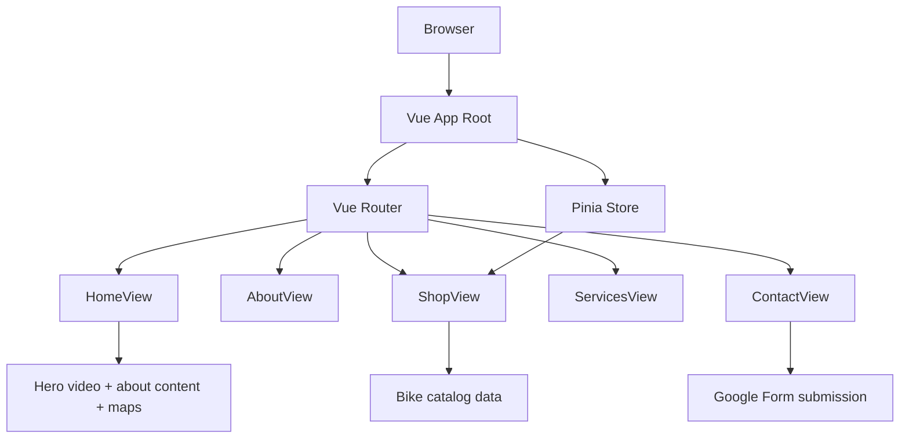
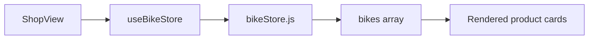

# Dragon and Son Website Architecture

## 1. Project overview

This project is a Vue 3 single-page application with client-side routing and Pinia state management. It is structured as a lightweight storefront and marketing site for a bike shop brand.

The app uses:

- Vue 3 for frontend UI
- Vue Router for multi-page navigation
- Pinia for shared application state
- Bootstrap 5 for layout and styling
- Vite for build tooling and local development

---

## 2. High-level architecture



### Architectural layering

1. Presentation layer
   - Vue components and views render all user-facing pages.
   - Shared layout lives in the app shell.

2. Routing layer
   - Vue Router controls navigation between pages.
   - Each route maps to a dedicated view component.

3. State layer
   - Pinia centralizes shared state like product catalog data.
   - This keeps data consistent across multiple components.

4. Styling layer
   - Bootstrap provides the base UI system.
   - Custom styles sit in the CSS layer for brand-specific adjustments.

5. Integration layer
   - Contact form sends data to a Google Forms endpoint.
   - Google Maps is embedded directly in the landing page.

---

## 3. Folder structure

```text
project-root/
├── documentation/
│   └── ARHITECTURE.MD
├── src/
│   ├── App.vue
│   ├── main.js
│   ├── styles.css
│   ├── router/
│   │   └── index.js
│   ├── stores/
│   │   └── bikeStore.js
│   └── views/
│       ├── HomeView.vue
│       ├── AboutView.vue
│       ├── ShopView.vue
│       ├── ServicesView.vue
│       └── ContactView.vue
├── index.html
├── package.json
├── vite.config.js
├── .gitignore
└── README.md
```

---

## 4. Core application files

### App shell
- App.vue
  - Contains the shared navigation bar
  - Renders the page layout and footer
  - Hosts the router view area

### Bootstrap entry
- main.js
  - Creates the Vue app instance
  - Registers Pinia
  - Registers Vue Router
  - Loads Bootstrap CSS and JS
  - Loads the global stylesheet

### Router setup
- router/index.js
  - Declares all frontend routes
  - Uses browser history mode for clean URLs

### State management
- stores/bikeStore.js
  - Holds product data for the shop catalog
  - Exposes the bike list to the storefront pages

### Global styling
- styles.css
  - Handles custom theme colors
  - Overrides component spacing and layout
  - Styles hero sections, cards, maps, and form blocks

---

## 5. Page map and navigation structure

### Route mapping

```mermaid
graph LR
    A[/] --> B[HomeView]
    A --> C[/about]
    C --> D[AboutView]
    A --> E[/shop]
    E --> F[ShopView]
    A --> G[/services]
    G --> H[ServicesView]
    A --> I[/contact]
    I --> J[ContactView]
```

### Page responsibilities

#### Home page
- URL: /
- Component: HomeView.vue
- Purpose:
  - Hero banner with background video
  - Intro messaging and calls to action
  - About section for brand identity
  - Google Maps integration
  - Local business listing details

#### About page
- URL: /about
- Component: AboutView.vue
- Purpose:
  - Explains the company story
  - Highlights shop values and expertise
  - Builds trust for potential customers

#### Shop page
- URL: /shop
- Component: ShopView.vue
- Purpose:
  - Renders bike products from Pinia
  - Shows categories and pricing in card layout
  - Encourages browsing and product reservation

#### Services page
- URL: /services
- Component: ServicesView.vue
- Purpose:
  - Lists bike repair and tune-up services
  - Shows service categories with short descriptions
  - Positions the business as a full-service shop

#### Contact page
- URL: /contact
- Component: ContactView.vue
- Purpose:
  - Provides contact details
  - Displays a custom form
  - Submits data to a Google Form response endpoint

---

## 6. Navigation behavior

The top navigation is defined in App.vue and includes links to:

- Home
- About
- Shop
- Services
- Contact

This provides a consistent site-wide navigation bar across all pages and keeps users within the same app experience without full page reloads.

---

## 7. State flow



### Store behavior
- The Pinia store holds the bike catalog as application state.
- ShopView reads the bike list via storeToRefs.
- Components remain decoupled from raw local data definitions.
- The state layer is reusable for future features like cart, filters, or inventory data.

---

## 8. Page data and content flow

### Landing page flow
- User arrives on the home page.
- Hero section loads video background and message blocks.
- About section communicates the business story.
- Map embed loads location data from Google Maps.

### Commerce flow
- User navigates to the shop page.
- App reads bike list from Pinia.
- Data is rendered into reusable product cards.

### Service flow
- User navigates to the services page.
- Static service list is displayed as structured cards.
- This page acts as a conversion tool for bookings and consultations.

### Contact flow
- User opens the contact form.
- Form submits to the configured Google Form endpoint.
- The business receives the form response in Google Sheets or Google Forms reporting.

---

## 9. Future extension points

This architecture is ready for expansion with:

- Shopping cart store
- Product detail pages
- Checkout flow
- Wishlist and favorites
- Blog or magazine section
- CMS-driven content
- Real bike inventory data from an API

---

## 10. Summary

The project follows a clean Vue architecture:

- Router handles page transitions
- Pinia handles shared state
- Bootstrap handles responsive layout
- Views remain focused on display and user interaction
- The app is modular enough to grow into a larger storefront or business website

This structure keeps the codebase easy to understand, easy to extend, and suitable for future feature additions.
